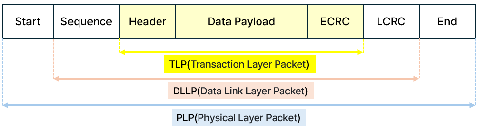

## 🌈PCIe Layer Structure

▪️NVMe 자체는 PCIe보다 상위의 프로토콜이며, PCIe는 NVMe의 물리적 운송 수단 중 하나

→ *따라서 PCIe 계층부터 먼저 정확하게 잡고 NVMe 명령과 구조를 올라가는 것이 좋은 순서이다*

### ✅ PCIe 전체 계층 구조

**[계층별 역할 비유]**

1. Transaction Layer : 편지를 작성 (내용, 주소, 서명)

2. Data Link Layer : 편지를 봉투에 넣고 등기 우편 처리 (오류 검사, 번호 부여)

3. Physical Layer : 편지를 트럭에 실어 실제 배달 (트럭, 도로, 신호등 관리)

### ✅ Transaction Layer

**☑️ 개요**

***"장치 간 명령과 데이터를 실은 패킷을 처음으로 만드는 계층"***

- PCIe 계층 구조의 최상위 계층

- CPU, NVMe, GPU, 기타 PCIe Device들이 메모리 읽기/쓰기, IO, Message, Atomic 명령을 생성하는 계층

- 실제 데이터를 포함한 'Transaction Layer Packet (TLP)'을 생성

> 이 계층에서 생성된 TLP는 Data Link Layer와 Physical Layer를 통해 전송됨

**☑️ 주요 역할**

**1. 명령 생성 (Read/Write/Message)**

CPU, NVMe, GPU 등은 메모리 주소에 접근하거나 다른 장치에 메시지를 보내야 할 때 PCIe Transaction Layer에서 TLP Type을 지정하여 TLP Header에 있는 Type 필드에 명시함

> **Type 종류**
> 
> - Memory Read: 특정 주소에서 데이터 읽기 요청 (예: NVMe CQ Polling 시 사용)
>
> - Memory Write: 특정 주소에 데이터 쓰기 요청 (예: NVMe SQ에 Command 쓰기)
>
> - IO Read/Write: IO 공간 접근 (PCI legacy 호환)
>
> - Message: IRQ, PME, ATS, Error Report 등 Message-based 명령 (MSI/MSI-X도 포함)
>
> - Atomic: Read-Modify-Write (예: Atomic Compare and Swap, Gen2 이상)
>
> - Completion: Read 요청에 대한 응답 (Host → Device 또는 Device → Host)

**2. 패킷(TLP) 생성**

- **TLP(Transaction Layer Packet)의 구조**

- Transaction Layer는 Header + Payload 형태의 TLP 패킷 생성

- 생성된 TLP는 Data Link Layer로 넘겨져 오류 보호를 받음

**▪️TLP Header**

> - Type (Read, Write, Msg 등)
>
> - Length (Payload 크기)
>
> - Address (목적지 메모리 주소)
>
> - Tag (식별자, 멀티 Outstanding 지원)
>
> - Attributes (QoS, Ordering, Snooping 속성)

**▪️TLP Payload**

> - Read → Payload 없음, Write → Payload 포함
>
> - Write일 경우 데이터 포함
>
> - Read일 경우 요청만 (응답 시 Completion TLP로 데이터 전달)

**3. 주소(Address) 관리** 

- Transaction Layer는 어디(Address)에 명령을 보내야 하는지 결정

- 주소는 Memory Space, IO Space, Configuration Space, Message Space 등 구분

> 특히 NVMe에서는 주로 Memory Address (BAR에서 Mapping된 주소) 사용

**4. 속성(Attribute) 부여**

- 종류 : Relaxed Ordering, No Snoop, ID Based Ordering 등

> - No Snoop(NS): CPU Cache bypass 여부 (NVMe는 일반적으로 사용)
>
> - Relaxed Ordering(RO): 명령 순서 보장 여부 (성능 vs 데이터 무결성 trade-off)
>
> - ID Based Ordering: TLP의 ID 기준 순서 강제 (Gen3 이후)

- Transaction Layer에서는 TLP의 성격을 결정하는 Attribute 부여

- 시스템 최적화, 성능 개선에 중요

**5. Tag 관리 (식별자)**

- Tag 용도 : TLP 구분용, 멀티 Outstanding 처리 

- PCIe는 동시에 여러 개의 Read TLP를 보내고 여러 개의 Completion을 받을 수 있음

- CPU가 여러 Read를 한 번에 요청하고, Completion이 순서 없이 올 경우 Tag로 식별해야 함

- 이를 위해 각 Read TLP에 Tag 부여 (8bit, 최대 256개) → Completion TLP에서 Tag로 구분

### ✅  Data Link Layer

### ✅  Physical Layer
