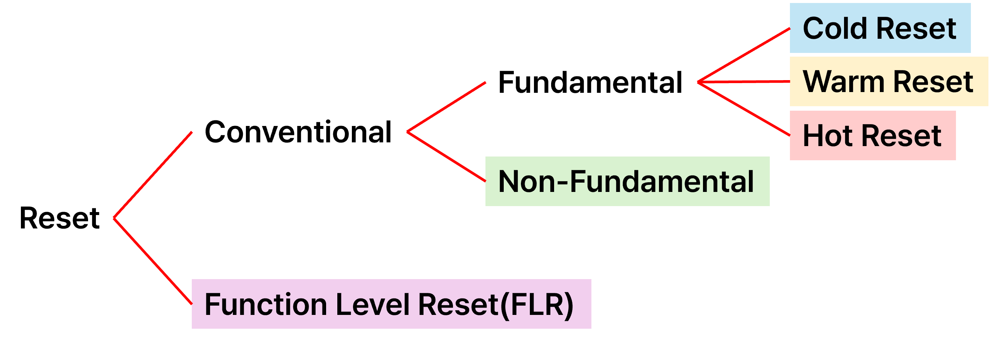

## ✏️ Reset 내용 정리 ✏️

### 📜Agenda

- [✅ 1. Conventional Reset](#-1-conventional-reset)
- [✅ 2. Fundamental Reset](#-2-fundamental-reset)
- [✅ 3. Cold Reset](#-3-cold-reset)
- [✅ 4. Warm Reset](#-4-warm-reset)
- [✅ 5. Hot Reset](#-5-hot-reset)
- [✅ 6. Non-Fundamental Reset](#-6-non-fundamental-reset)
- [✅ 7. Function Level Reset (FLR)](#-7-function-level-reset-flr)
- [✅ 추가) NVMe Reset 이후 초기화 절차 및 Admin Queue 정리](#-추가-nvme-reset-이후-초기화-절차-및-admin-queue-정리)
   
  
### ▶️ Reset의 종류

 

### ✅ 1. Conventional Reset 

🔸전통적인 의미의 Reset으로, Device 전체를 초기 상태로 되돌리는 리셋 방법

🔸주로 전원이나 리셋 신호(PERST#)을 통해서 트리거 됨

### ✅ 2. Fundamental Reset

🔸Device 전체 를 전원 인가 직후 상태로 되돌리는 리셋 방식

🔸전원 수준, 범위 등에 따라 Cold, Warm, Hot으로 나뉘어진다.

### ✅ 3. Cold Reset

#### 1) 개념

🔸디바이스 전원을 껐다가 켜는 것과 동일한 효과를 주는 리셋 방식으로, 하드웨어 차원에서 디바이스를 완전히 초기화한다.

🔸 PCIe 장치는 마치 시스템 부팅 시 전원을 처음 인가받은 것처럼 초기 상태로 되돌아간다.

🔸 단순히 큐나 레지스터를 초기화하는 게 아니라, 전원 차단을 수반하므로 휘발성 메모리(DRAM, MMIO 등)도 모두 소멸된다.

> 즉, 소프트웨어 리셋이 아닌 하드웨어 리셋,디바이스 자체를 *“다시 켠다”* 는 개념이기 때문에 가장 강력하고 포괄적인 리셋 방식이다.

#### 2) Cold Reset 트리거 방식

🔶 **하드웨어 기반 리셋**

🔸 PERST# 핀(Power-on Reset Signal) 이 Assert될 때 발생

 > PERST#는 Active-Low (Low일 때 리셋 작동)

🔸 이 신호는 전원 공급 회로나 칩셋, 리셋 버튼, BMC 등에 의해 제어될 수 있다.

🔷 **시스템 레벨 전원 관리**

🔹 전원 불안정, 시스템 전원 Off/On, 리셋 스위치 등으로도 발생

 > BIOS/UEFI 또는 ACPI가 플랫폼 레벨에서 전원 리사이클을 유도함

🔹 Power Cycling 또는 Platform Reset 이벤트도 Cold Reset 트리거 가능

🔹 ⚠️ 순수 전원 기반 리셋이므로 코드로는 구현 불가 (소프트웨어 명령으로는 불가능)

#### 3) Cold Reset 동작 과정

1️⃣ PERST#가 Assert됨 (Active Low)

* 디바이스가 리셋 상태로 진입

* 내부 상태 머신, 레지스터, 버퍼, DRAM 등 휘발성 정보 모두 초기화됨

2️⃣ 전원 공급 → 디바이스 전원 인가 직후 상태로 복귀

* ROM(내장 펌웨어)에서 초기화 코드 로딩

* 기본 세팅값으로 초기화 수행

3️⃣ Configuration Space 초기화

* Device ID, Vendor ID, Class Code, BAR 등 모두 초기값으로 복귀

4️⃣ Link Training 재시작

* LTSSM(Link Training and Status State Machine) 상태 머신 동작

* Root Complex ↔ Endpoint 간 PCIe 링크 재협상 수행

5️⃣ 정상 동작 상태 복귀 (L0 진입)

* Link 상태가 L0(Active)로 진입 → 디바이스 사용 가능

####  4) NVMe관점에서의 영향

🔸 Cold Reset은 PCIe 레벨 리셋이기 때문에, NVMe 디바이스도 초기화 대상이다.

🔸 NVMe Controller 내부의 CC(Control Register), CSTS(Status Register), 큐, 메모리 맵, Identify 정보까지 모두 삭제됨

🔸 OS 입장에서는 디바이스가 시스템에서 완전히 사라졌다가 다시 장착된 것처럼 인식

🔸 이후 드라이버가 다시 BAR 할당, Identify 명령 수행, 큐 재생성 등의 절차를 통해 재사용 가능

### ✅ 4. Warm Reset

#### 1) 개념

🔸**전원은 유지한 상태**에서 디바이스를 초기화하는 리셋 방식

> *디바이스의 내부 논리 회로, 상태 머신 등을 초기화하지만 전원 공급은 계속됨*
>
> *전원을 끄지 않고도 리셋할 수 있다는 점에서 Cold Reset과 차이가 있음*

🔸디바이스의 Configuration Space는 초기화되며, Link Training도 재진행

> *Configuration Space : PCIe 디바이스의 속성, 제어 정보, 상태 정보를 저장하는 공간*
>
> *Link Training은 PCIe : Root Complex와 Endpoint가 데이터를 주고받기 전에 링크를 설정하는 과정*
>
>> *`Root Complex (RC)` : CPU와 메모리 시스템을 PCIe로 연결해주는 브리지로, PCIe 네트워크의 출발점을 의미함*
>> 
>> *`Endpoint (EP)` : Root Complex에 연결된 최종 PCIe 디바이스로, Root Complex랑 연결된 진짜 일하는 장치들을 의미함*

#### 2) Warm Reset 트리거 방식

🔶 **소프트웨어 제어 방식**

🔸Root Complex가 소프트웨어적으로 리셋을 트리거.

🔸Root Port나 Downstream Port에서 Warm Reset을 Initiate.

🔷 **하드웨어는 유지**

🔹전원은 끄지 않고, PERST#는 건드리지 않음.

#### 3) Warm Reset 동작 과정

1️⃣ Root Complex가 Warm Reset Initiate

* 디바이스 리셋을 위해 내부 시퀀스 시작

2️⃣ 디바이스 논리 회로 초기화

* 내부 레지스터, 상태 머신 초기화.

* 소프트웨어 컨트롤러가 해당 디바이스를 리셋.

3️⃣ Configuration Space 초기화

* PCIe Config Space (Header Registers, Capability Registers 등) 초기화.

4️⃣ Link Training 재시작

* LTSSM(Link Training Status State Machine) 재진입.

* Root Complex와 Endpoint 간 Link 재협상.

5️⃣ 정상 동작 상태로 복귀

* L0 (Active State)로 진입 후 정상 운영.

### ✅ 5. Hot Reset

#### 1) 개념

🔸디바이스나 하위 Bus 레벨에서 수행하는 리셋 방식으로 PCIe 링크 상에서 연결을 끊고 재연결함.

🔸Cold/Warm Reset처럼 디바이스 전체 초기화를 유도하지만, **전원을 끄지 않고 수행**된다.

> 전원은 계속 연결되어 있고 신호만 끊음으로써 *“다시 연결되었구나”* 라고 느끼게 만들어 Link 재협상(link re-training) 을 강제로 유도한다.

🔸Link Training은 다시 수행하지만, 전원은 유지되고 PERST#는 사용하지 않음

> 흔히 *“PCIe 장치를 뺐다 다시 꽂은 것처럼”* 작동하며, 실제로 LTSSM 상태가 L0 → Detect → Polling → L0로 전이됨.

🔸PCI-to-PCI 브리지나 PCIe 스위치의 Bridge Control Register 내 **"Secondary Bus Reset Bit"** 를 통해 트리거

> `Secondary Bus Reset Bit` : PCIe 브리지 장치의 Bridge Control Register에 있는 리셋 제어 비트
>
> 이 비트를 1로 설정하면, 브리지 아래쪽(Secondary Bus)에 연결된 모든 디바이스들이 리셋

#### 2) Hot Reset 트리거 방식

🔶 **소프트웨어 제어 방식**

🔸Root Complex가 PCI Configuration Space의 Secondary Bus Reset Bit를 Write하여 트리거

🔸PCI-to-PCI 브릿지 장치나 PCIe 스위치에서 주로 사용

🔸직접적인 전원 제어나 PERST# 핀은 사용되지 않는다

🔷 **범위는 “Bus 단위”**

🔹Hot Reset은 단일 디바이스가 아니라 브리지 아래 전체 Bus의 모든 디바이스에 적용된다

🔹따라서 하나의 디바이스만 영향을 받는 게 아니라, 하위 연결된 모든 장치가 재협상을 수행하고, 설정이 초기화된다

#### 3) Hot Reset 동작 과정

1️⃣ Root Complex가 Secondary Bus Reset Bit를 Set

* PCIe 스위치 또는 브리지 디바이스의 Config Space에서 해당 비트를 1로 설정

2️⃣ 하위 Bus에 연결된 모든 디바이스 초기화

* 각 디바이스의 내부 논리 회로 및 상태 머신 초기화

3️⃣ Configuration Space 초기화

* PCIe의 Config 영역 (Device ID, Vendor ID, BAR 등)이 초기화되며,이 후 OS 또는 드라이버가 이를 재설정해야 함

4️⃣ Link Training 재시작

* LTSSM(Link Training and Status State Machine)이 Detect 상태로 전이되어 Polling → Configuration → L0로 진행

5️⃣ 정상 동작 상태로 복귀

* 각 디바이스는 다시 L0 상태로 복귀하고, OS가 재설정 이후부터 장치를 정상 사용 가능

#### 4) NVMe 관점에서의 영향

🔸 Hot Reset은 PCIe 버스 레벨에서 수행되지만, NVMe 컨트롤러도 직접적인 영향을 받음.

🔸 NVMe Controller의 CC(Control Register), CSTS(Status Register), Admin Queue, I/O Queue, Memory Mapping 등 모두 초기화됨.

🔸 진행 중인 I/O 명령은 중단되며, OS나 드라이버가 NVMe 디바이스를 다시 초기화해야 함.

🔸 BAR 재할당, Identify 명령 재수행, 큐 재생성 등이 필요함.

> 결과적으로 NVMe Controller Reset에 가까운 상태가 됨.

#### 5) 목적 및 활용 사례

🔸 디바이스 오류 복구

 >컨트롤러 응답 없음 상태에서 연결을 재수립하여 회복 유도

🔸 링크 초기화

 > PCIe 신호 설정(속도, 전압 등)이 꼬였을 때 링크 초기 상태로 되돌림

🔸 펌웨어 업데이트 후 연결 재수립

 > 전원 없이도 새로운 상태로 리셋 가능

🔸 PCIe 에러 복구

 > TLP 오류, LCRC 오류 등 지속적 전송 오류 발생 시 복구 메커니즘으로 사용

#### ⭐ Fundamental Reset 종류 요약 비교⭐

| 항목                        | Cold Reset                          | Warm Reset                           | Hot Reset                                |
|----------------------------|-------------------------------------|--------------------------------------|-------------------------------------------|
| **Trigger**                | PERST# 핀 (하드웨어 Trigger)        | Root Complex 소프트웨어 제어         | Secondary Bus Reset Bit (소프트웨어 Trigger) |
| **전원 상태**              | Off → On (전원 순환)                | On (전원 유지)                       | On (전원 유지)                             |
| **Configuration Space**    | 초기화됨                            | 초기화됨                             | 초기화됨                                   |
| **Link Re-training**       | 필요함 (LTSSM 재진입)               | 필요함                               | 필요함                                     |
| **영향 범위**              | 단일 디바이스                       | 단일 디바이스                        | 하위 Bus 전체                             |
| **PERST# 사용**            | ✅ 사용                              | ❌ 미사용                            | ❌ 미사용                                 |
| **복구 시간**              | 가장 느림 (전원 포함)              | 중간                                 | 중간                                       |
| **주 사용 사례**           | 시스템 전원 재부팅, 전원 복구 등     | 디바이스 논리 초기화, 안정적 복구 필요 시 | Bus 하위 디바이스 오류 복구, 스위치 리셋 등 |

### ✅ 6. Non-Fundamental Reset

#### 1) 개념

🔸디바이스의 PCIe Configuration Space를 유지한 채, 제한된 범위의 상태만 복구하는 리셋 방식

🔸주로 Data Link Layer 수준의 오류 복구, 일시적 장애 대응, 통신 복원을 목적으로 사용됨

🔸디바이스의 논리 회로 전체를 초기화하지 않음, 따라서 Cold/Warm/Hot Reset과 구별됨

#### 2)  Non-Fundamental Reset 트리거 상황

🔹Data Link Layer 오류: TLP CRC 오류, LCRC 오류 등.

🔹Replay Timer Expiry: 수신자가 ACK을 제때 주지 않을 때 발생.

🔹LTSSM의 예외 전이: 링크가 일시적으로 불안정할 때 Detect 상태로 전이.

🔹Link Down 복구 시도: 일시적으로 Link가 끊긴 후 다시 올라올 때.

🔹Surprise Down / Hot-Plug 이벤트: 디바이스 삽입/제거 상황에서 비정상 Link 동작 복구.

### ✅ 7.  Function Level Reset (FLR)

#### 1) 개념

🔸PCIe 장치 내부의 특정 Function만 초기화하는 리셋 방식

🔸전통적인 리셋 방식(Fundamental Reset)과 달리, 디바이스 전체가 아닌 Function 단위로만 리셋됨

🔸Multi-function 디바이스에서 개별 기능을 리셋할 수 있는 유연한 방법

> 예를 들어 NIC(Network Interface Card)가 여러 Virtual Function(VF)을 가진 경우 한 VF에 오류가 있어도 전체 디바이스를 리셋하지 않고 해당 VF만 리셋 가능
>
> 가상화(VM), SR-IOV 환경에서 각 가상 머신에 독립적으로 Function을 할당하고, 문제가 생긴 VM만 리셋할 때 사용.

#### 2) FLR 트리거 방식

🔸소프트웨어가 Function의 PCIe Configuration Space에 있는 특정 레지스터 (Command Register) 에 FLR을 요청.

> `Initiate Function Level Reset` 명령을 통해 수행됨.

#### 3) FLR 동작 과정

1️⃣ OS 또는 Hypervisor가 FLR 요청 (Function의 Config 공간에 쓰기)

2️⃣ 해당 Function만 초기화됨

* 내부 논리 회로, 상태, 컨텍스트 등 초기화

3️⃣ 다른 Function에는 영향 없음

4️⃣ PCIe 링크는 유지됨 (Link Re-training 불필요)

5️⃣ 해당 Function이 다시 사용 가능해짐

### ✅ 추가) NVMe Reset 이후 초기화 절차 및 Admin Queue 정리

#### 1) 배경: 왜 이런 초기화가 필요한가?

NVMe 디바이스는 **Reset (Controller Reset, Subsystem Reset, PCIe Hot/Cold Reset 등)** 이후  **모든 논리 상태와 큐 정보가 유실**된다.  

➡️ 따라서 **다시 장치를 "초기화"해주는 명령 시퀀스가 필요**하다.

즉, 리셋은 “전기적 초기화”이고, 이 이후에 “논리적 초기화”를 **호스트가 직접 수행**해야  디바이스를 정상적으로 사용할 수 있다.

#### 2) Reset 이후의 필수 초기화 순서

Reset 이후에는 보통 다음과 같은 순서로 NVMe 컨트롤러를 재초기화한다:

| 순번 | 단계 | 설명 |
|------|------|------|
| 1️⃣ | **Admin Queue 생성** | 컨트롤러와의 명령 통신을 위한 기본 채널 |
| 2️⃣ | **Identify Controller** | 컨트롤러의 정보 조회 (용량, 기능 등) |
| 3️⃣ | **Set Features** | 원하는 동작 모드/설정 적용 (ex. 큐 개수, IRQ 등) |
| 4️⃣ | **Namespace Attach** | I/O 명령을 보낼 대상(Namespace)을 컨트롤러에 연결 |
| 5️⃣ | **I/O Queue 생성** | 실제 데이터 송수신용 큐 (고성능 다중 큐 구성 가능) |
| 6️⃣ | **Identify Namespace** | 연결된 Namespace 정보 조회 (용량, 상태 등) |

➡️ 이 일련의 절차가 끝나야 NVMe 디바이스는 정상적인 I/O를 수행할 수 있음.

#### 3) Admin Queue란?

Admin Queue는 **NVMe 컨트롤러와 통신을 시작할 때 반드시 먼저 설정해야 하는 큐 쌍**이다.

| 구성 요소 | 설명 |
|-----------|------|
| **Submission Queue (SQ)** | 호스트가 명령을 “적어 넣는” 큐 |
| **Completion Queue (CQ)** | 컨트롤러가 “명령 완료”를 알리는 큐 |
| **Admin Queue** | 위 두 큐의 특별한 인스턴스, **관리 명령 전용** (Identify, Set Features 등 수행) |

#### 4) Admin Queue 생성 과정 (리셋 후)

> `(리셋 후 컨트롤러 비활성화 상태: CC.EN == 0)`

1️⃣ **ASQ (Admin Submission Queue Base Address) 설정**  

→ 호스트가 명령을 작성할 버퍼 주소

2️⃣ **ACQ (Admin Completion Queue Base Address) 설정**  

→ 컨트롤러가 Completion을 기록할 버퍼 주소

3️⃣ **AQA (Admin Queue Attributes) 설정**  

→ 큐의 엔트리 수 설정

4️⃣ **CC (Controller Configuration) 레지스터 설정**  

→ EN 비트를 1로 설정하여 컨트롤러 활성화

5️⃣ **CSTS (Controller Status) RDY == 1 확인**  

→ 컨트롤러가 초기화 완료되고 동작 준비 완료되었는지 확인

#### 5) Admin Queue 명령 처리 흐름

이제 큐가 설정되었으므로, Admin 명령을 다음 흐름으로 주고받을 수 있다:

#### 명령 전송 (호스트 → 컨트롤러)

1️⃣ 호스트는 **Submission Queue**에 명령을 작성한다  

> (ex: Identify 명령 = 컨트롤러 정보 요청)

2️⃣ **Doorbell 레지스터**를 통해 컨트롤러에게 명령이 준비되었음을 알림

#### 명령 처리 (컨트롤러 → 호스트)

3️⃣ 컨트롤러는 명령을 읽고 수행한 후, **Completion Queue**에 결과를 작성

4️⃣ 호스트는 CQ에서 Completion Entry를 확인하고 다음 동작을 수행함

> 이 구조는 I/O 명령에서도 동일하지만,
> 
> **Admin Queue는 리셋 직후 필수 설정 채널**로 가장 먼저 사용됨

---
---
---
---
### 이 아래는 예전에 정리한 내용 -> 추후 위에 합치면서 정리할 예정
---

1. Controller Reset

2. Subsystem Reset

3. PCIe Hot Reset

4. PCIe Cold Reset

### ▶️ 1. Controller Reset

#### 1) 개념

🔸 NVMe 디바이스의 하나의 컨트롤러만 논리적으로 초기화하는 과정 (NVMe 컨트롤러를 껐다가 다시 킨 느낌)

🔸 Admin Queue, I/O Queue, Features 설정 등 컨트롤러 관련 상태 정보 전체를 초기 상태로 되돌리는 역할

#### 2) 구체적으로 수행하는 동작

🔸모든 Submission/Completion Queue가 삭제됨

> `Submission Queue (SQ)` : 호스트가 "이거 읽어줘", "이거 써줘" 하고 요청을 적는 명령 리스트
>
> `Completion Queue (CQ)` : 컨트롤러가 "이 요청 끝났어!" 라고 결과를 적어주는 공간
>
> 리셋이 되면 이 큐들이 모두 사라져서, 아무 명령도 보낼 수 없고 받을 수 없음

🔸Features 명령어로 설정된 휘발성 설정(Volatile Features) 초기화

> Features 명령은 NVMe 장치의 작동 방식(성능, 전력 등)을 조정하는 명령
>
> 이 중 일부는 휘발성(volatile)이라서, 전원이나 리셋 시 초기화(PM, Write Cache 등)

🔸명령 대기 중인 큐의 명령은 실패(Command Aborted) 처리

> 리셋이 발생할 때 이미 큐에 올라간 명령(예: 읽기/쓰기 요청)이 있었다면, 마무리하지 않고 그냥 포기

🔸Identify 정보를 다시 획득해야 함

> Identify 명령은 디바이스가 “나 이런 구조, 용량, 포맷이야” 라고 정보를 알려주는 명령
>
> 이 명령을 통해 컨트롤러 정보/네임스페이스 정보 등을 확인

🔸Namespace는 비활성화 상태로 되며, 필요 시 다시 Attach 필요

> Namespace란 실제 데이터 저장 공간(SSD 파티션 같은 개념)
>
> Host가 이 공간에 접근하기 위해서는 Attach(연결)되어 있어야 한다.

#### 3) 수행 방법

🔸NVMe에서 Controller Reset은 명령어 기반이 아니라, PCIe를 통한 레지스터 조작으로 수행

🔸즉 NVMe 레지스터의 CC, CSTS 등은 PCI BAR 영역을 통해 메모리 주소에 매핑 되므로, 이 주소에 read/write하는 코드를 작성함으로써 조작 가능

#### 4) 레지스터 변화: Controller Reset은 다음 두 레지스터를 사용해 수행

🔸`CC (Controller Configuration Register)`

> EN (Enable) 비트가 0이면 컨트롤러 비활성화 상태 -> 이 값을 통해 컨트롤러 리셋을 트리거

🔸`CSTS (Controller Status Register)`

> 현재 컨트롤러 상태를 나타냄 -> CSTS.RDY = 1 이면 컨트롤러 준비 완료, 0 이면 비활성화 또는 리셋

#### 5) 리셋 절차
> 1. CC.EN = 0                       ← 컨트롤러 비활성화 요청
> 
> 2. Wait for CSTS.RDY = 0          ← 컨트롤러가 비활성화 되었는지 확인
>    
> 3. (필요 시 Admin Queue 설정 재작성)
>    
> 4. CC.EN = 1                       ← 컨트롤러 재활성화
>    
> 5. Wait for CSTS.RDY = 1          ← 컨트롤러가 준비되었는지 확인
>     
> 6. Identify 명령, Features 재설정, Namespace Attach 등 수행

### ▶️ 2. Subsystem Reset

#### 1) 개념

🔹 NVMe Subsystem이란 하나 이상의 NVMe Controller와 Namespace들이 소속된 논리적 단위

🔹 Subsystem Reset은 이 전체 묶음을 한 번에 리셋 하는 것(컨트롤러를 포함한 전체 NVMe 시스템을 초기화)

#### 2) Subsystem Reset의 트리거 조건

: 자동 발생하거나, 플랫폼/펌웨어/OS에서 제어할 수 있다.

 🔹CC.EN 비트를 0으로 설정했는데 CSTS.RDY가 2초 안에 0이 되지 않음

> 컨트롤러가 응답 불능이므로, 자동으로 Subsystem Reset 발생

🔹 PCIe Cold Reset (전원 차단) 시 포함

🔹 펌웨어 명령 또는 시스템 이벤트로 Subsystem 전체 초기화

🔹 따라서 Admin command로는 조절 X 

> 코드 상으로 CC.EN과 CSTS.RDY 상태를 제어함으로써 조절 가능

#### 3) 수행 동작

: 모든 컨트롤러 리셋, 모든 큐(Admin 및 I/O 큐) 제거, 모든 휘발성 Features 초기화, 모든 명령 상태 중간, 모든 네임스페이스 연결 비활성화(다시 Attach 필요) 등

#### 4) 레지스터 및 동작 흐름

: Subsystem Reset은 어떤 단일 레지스터를 write해서 직접 수행하지는 않지만, 보통 Controller Disable 실패 상황이 발생하면 트리거 됨

> "Controller Disable 실패"란 CC.EN=0 후 CSTS.RDY=0 미 도달인 경우

🔹CC (Controller Configuration) 

> CC.EN = 0: 비활성화 요청

🔹CSTS (Controller Status) 

> RDY 비트가 2초 안에 0이 안 되면 → Subsystem Reset 발생

#### 5) 수행 흐름

> 1. OS가 CC.EN = 0으로 설정 (Controller Disable 시도)
>    
> 2. CSTS.RDY != 0 상태가 2초 이상 유지됨
>  
> 3. 컨트롤러가 응답 없음으로 판단됨
>  
> 4. 펌웨어 또는 플랫폼이 Subsystem Reset을 강제 수행
> 
> 5. 이후 모든 컨트롤러 및 자원이 재초기화됨
 
### ▶️ 3. PCIe Hot Reset

#### 1) 개념

🔸 PCIe Hot Reset은 PCI Express 링크 상의 디바이스 연결을 끊고 다시 재 연결하는 동작

🔸 흔히 "PCIe 장치가 뺐다 다시 꽂힌 것처럼" 논리적으로 재협상(link re-training)을 수행

🔸 전원은 계속 연결되어 있고 신호만 끊음으로써 “다시 연결되었구나”라고 느끼도록

#### 2) 목적

🔸 디바이스 오류 복구

> 컨트롤러가 먹통일 때 재연결을 시도하여 recovery를 유도

🔸 링크 초기화

> 전송 속도나 설정이 꼬였을 때 가시 초기 상태로 맞추기

🔸 펌웨어 업데이트 후 연결 회복 

> 전원을 끄지 않고도 디바이스 전체 동작 상태 초기화 가능 

🔸 PCIe 에러 복구 

> Transaction Layer Packet(TLP) 오류가 계속 발생할 경우 recovery

#### 3) 수행 동작

🔸 PCIe링크 재훈련 발생 : L0 → Detect → L0 

🔸 Configuration 공간 초기화(BAR, ID등) -> OS가 재설정 해야함

🔸 NVMe 컨트롤러의 CC, CSTS, 큐, 설정 모두 초기화됨(Controller Reset과 비슷한 상태)

🔸 메모리 매핑(MMIO) BAR주소 재할당 필요

🔸 진행 중인 I/O명령 모두 중단
 
### ▶️ 4. PCIe Cold Reset (= PCIe Conventional Reset or Fundamental Reset)

#### 1) 개념

🔹 PCIe Cold Reset은 장치의 전원을 완전히 껐다가 다시 켜는 리셋

🔹 물리적으로든 논리적으로든, 이 Reset은 시스템이 해당 장치를 처음 부팅했을 때와 같은 상태로 되돌림

🔹 전지가 완전히 차단되므로 장치의 모든 휘발성 정보(MMIO 상태, Queue, 컨트롤러 레지스터, DRAM) 등이 완전히 초기화됨

> 단순히 명령 큐나 설정만 지우는 게 아니라, 하드웨어 자체를 다시 부팅시키는 수준

#### 2) 수행되는 방법

🔹 물리적 전원 차단: 서버 또는 시스템이 PCIe 슬롯에 공급되는 전원을 끊었다가 다시 넣음

🔹시스템 또는 펌웨어 트리거: BIOS/UEFI, BMC, ACPI 등이 제어하여 장치 전원을 리사이클

🔹 전원 자체를 끊는 방법이므로 **코드 상으로 구현 불가능**

### ➕➕ 5. 추가 내용

🔆 Reset 이후의 초기화 순서 (모든 Reset 이후에는 다음과 같은 순서로 장치를 재초기화해야 정상 동작)

> 1. Admin Queue 생성
>
> 2. Identify Controller 수행
>
> 3. 필요한 Features 설정
>
> 4. Namespace Attach
>
> 5. I/O Queue 생성
>
> 6. Identify Namespace 수행

🔆 Admin Queue (Submission Queue, Completion Queue)에 대해서

◾ 기본 개념 정리

▫️ `Submission Queue` : Host가 NVMe 컨트롤러에게 명령을 “적어 넣는” 공간

▫️ `Completion Queue` : NVMe 컨트롤러가 “이 명령 끝났어”라는 결과를 Host에 알려주는 공간

▫️ `Admin Queue` : 이 SQ/CQ의 특수한 인스턴스

> Admin 명령 전용 (Identify, Features 등)

◾ Admin Queue의 생성 흐름

> 1. 리셋 후 CC.EN = 0 유지
>
> 2. ASQ, ACQ, AQA 레지스터 설정 (주소 + 크기)
>
> 3. CC 레지스터 설정 → EN 비트 = 1 (컨트롤러 활성화)
>
> 4. CSTS.RDY == 1 되는지 확인
>
> 5. 이제 Admin Queue를 통해 Identify, Set Features 등 가능

◾ Admin Queue로 명령 전송하는 과정

> Host는 SQ에 명령 (예: Identify)을 작성
>
> Doorbell (DB) 레지스터를 이용해 컨트롤러에게 알림
> 
> 컨트롤러는 명령 수행 후 CQ에 Completion Entry 작성
> 
> Host는 CQ에서 Completion 읽고 처리
