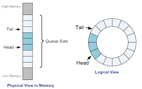

## 📘 SSD System Architecture

### ✅ 주요 구성 요소

**1. Host Interface & Protocol Engine**

**✔️ 구성요소**

- Physical Interface : SATA, PCIe 등

> Physical Interface (물리적 인터페이스) : 하드웨어 레벨에서 데이터를 전송하는 통신 통로
>
> SSD와 Host(CPU, 메인보드) 사이의 전기적/물리적 연결 구조를 의미 / 쉽게 말해, **"데이터가 지나가는 도로"** 라고 생각하면 됨
>
> PCIe는 Lane 개수, Gen 세대, 전기적 규격만을 정의할 뿐, 그 위에 진행하는 소프트웨어 동작(I/O 등)는 NVMe에 의해ㅔ서 처리됨 

- Protocol Engine : NVMe, AHCI 등 프로토콜 해석기

> 물리적인 인터페이스 위에서 "어떻게 데이터를 주고받을지"를 정해놓은 약속
>
> Host가 SSD에 명령을 어떻게 전달하고 응답을 받을지를 정의하는 소프트웨어/로직 수준의 통신 규칙 / 쉽게 말해, **"도로에서 차량이 어떻게 주행할지 정해놓은 교통법규"** 라고 생각하면 됨
>
> NVMe (Non-Volatile Memory Express) : PCIe 기반 SSD용 프로토콜

- Command Parser / Dispatcher

**✔️ 역할**

1) Physical Interface가 하는 일 (NVMe와는 무관한, 순수한 PCIe 하드웨어 레벨의 일)

- 전기적 신호의 수신/송신 (PCIe Gen4의 신호 처리)

- CRC 검증, packet framing (Data Link Layer 이하)

- Lane, Speed, LTSSM (Link Training State Machine) 제어

2) Protocol Engine(NVMe)가 하는 일

- Host(OS, CPU)에서 전송한 명령을 SSD Controller가 처리할 수 있는 구조체/데이터로 변환

- Submission Queue와 Completion Queue를 관리(PCIe BAR에 있는 큐 메모리를 해석하고, SSD 내부에서 명령 대기열 처리)

> 클릭 → [*Submission Queue와 Completion Queue에 대해서 알아보자*](#-Submission-Queue와-Completion-Queue)

- 명령의 종류를 파악하고(READ/WRITE/TRIM 등), SSD 컨트롤러에 전달

**2. SSD Controller (Embedded Processor 포함)**

**✔️ 구성요소**

- CPU Core (ARM, RISC-V): 펌웨어 실행 (FTL, GC, Wear Leveling)

- DMA Engine: DRAM ↔ NAND 간 대용량 데이터 이동

- NAND Interface Controller: NAND 명령어 및 타이밍 제어

- ECC Engine: NAND 오류 복구

- Clock, Reset, Power Control 등

**✔️ 역할**

- SSD의 두뇌. 펌웨어 로직 실행, NAND 제어, DRAM 관리

- 내부 병렬 작업 스케줄링, IO 명령 처리, 에러 핸들링

**3. DRAM (Buffer / Mapping Table Cache)**

**✔️ 구성요소**

- Data Buffer: Write/Read 중간 저장소

- Mapping Cache: FTL의 LBA-PPA 변환 테이블 일부 캐싱

- Metadata Storage: Block 상태, GC 히스토리 등

**✔️ 역할**

- Write 시 데이터 버퍼링 → 성능 향상

- Read 시 자주 사용하는 Mapping 정보를 빠르게 접근

- FTL의 대용량 테이블을 DRAM으로 Cache해서 성능 확보

**4. Firmware Layer (FTL, HAL 등)**

**✔️ 구성요소**

- FTL (Flash Translation Layer): LBA ↔ PPA 매핑

- HAL (Hardware Abstraction Layer): NAND 제어 abstraction

- GC, WL, Bad Block Management: NAND 유지 관리

- Command Scheduler, IO Prioritization

**✔️ 역할**

- NAND의 제약을 추상화하고, HDD처럼 동작하게 만듦

- Logical Address를 Physical Address로 변환

- GC/WL/Trim을 통해 성능과 수명을 유지

**✔️ FTL 방식 종류**

- Page Mapping: 성능 좋지만 테이블 큼

- Block Mapping: 테이블 작지만 쓰기 효율 낮음

- Hybrid Mapping: Hot/Cold data로 분리하여 최적화

**5. NAND Flash Media**

**🌈구성 구조**

SSD ↔ Channels ↔ Packages ↔ Dies ↔ Planes ↔ Blocks ↔ Pages

**✔️ 역할**

- 비휘발성 데이터 저장소. 실제 데이터를 저장하는 최종 지점

- Page 단위로 쓰고 Block 단위로 지움

**✔️NAND 특성**

- SLC(1bit), MLC(2bit), TLC(3bit), QLC(4bit)

- TLC/QLC는 용량 ↑, 성능 ↓, 수명 ↓

- Program/Erase Cycle 제한 존재 → Wear Leveling 필수

**6. Power Management Unit (PMU)**

**✔️ 구성요소**

- Voltage Regulators: NAND 및 컨트롤러에 전원 공급

- PLP Circuit (Power Loss Protection): 콘덴서 기반

- Thermal Sensor: 온도 감지 및 제어

**✔️ 역할**

- SSD의 각 구성 요소에 안정적인 전력 공급

- 갑작스러운 전원 차단 시 중요한 데이터 보호

- 온도에 따라 SSD 성능 조절 (Thermal Throttling)

### ✅ Submission Queue와 Completion Queue

1. 개요

▪️Submission Queue (SQ) : Host가 SSD에 보낼 명령(NVMe Command)을 저장하는 곳

▪️Completion Queue (CQ) : SSD가 명령을 처리한 결과를 Host에 통보하는 곳

▪️위치 및 접근 방법 : 모두 **Host Memory(RAM)**에 존재하며, SSD는 DMA로 접근

▪️관리방 : 각 Queue는 doorbell register + head/tail 포인터로 관리됨

