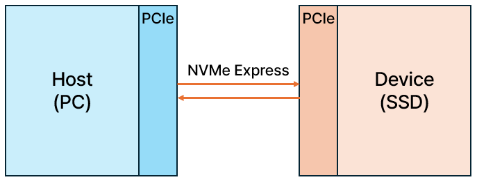
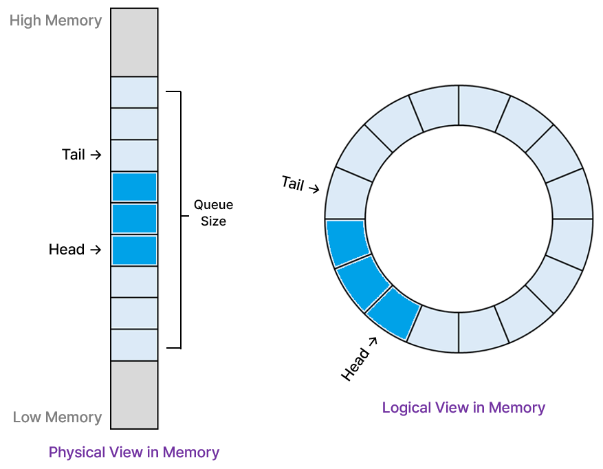
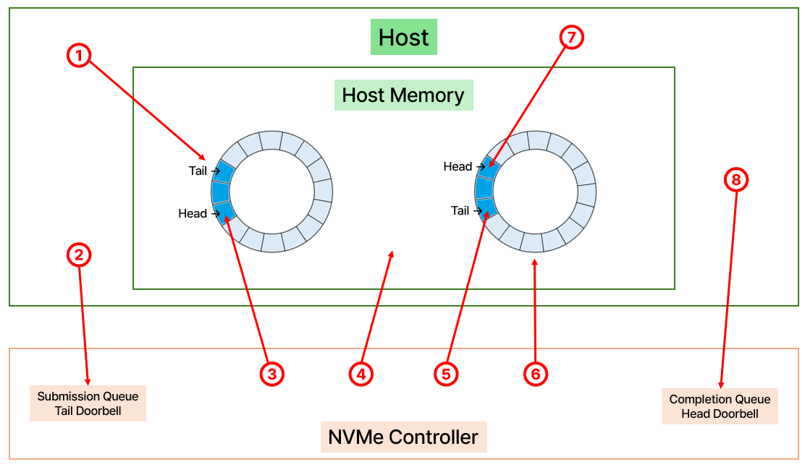

# 🌈Agenda

🔸SSD System Architecture [[Link]](#-SSD-System-Architecture)

🔸SSD Technology [[Link]](#-SSD-Technology)

🔸SSD Software Achitecture [[Link]](#-SSD-Software-Architecture)

 

## 📘 SSD System Architecture

### ✅ 주요 구성 요소

**1. Host Interface & Protocol Engine**

**✔️ 구성요소**

- Physical Interface : SATA, PCIe 등

> Physical Interface (물리적 인터페이스) : 하드웨어 레벨에서 데이터를 전송하는 통신 통로
>
> SSD와 Host(CPU, 메인보드) 사이의 전기적/물리적 연결 구조를 의미 / 쉽게 말해, **"데이터가 지나가는 도로"** 라고 생각하면 됨
>
> PCIe는 Lane 개수, Gen 세대, 전기적 규격만을 정의할 뿐, 그 위에 진행하는 소프트웨어 동작(I/O 등)는 NVMe에 의해ㅔ서 처리됨 

- Protocol Engine : NVMe, AHCI 등 프로토콜 해석기

> 물리적인 인터페이스 위에서 "어떻게 데이터를 주고받을지"를 정해놓은 약속
>
> Host가 SSD에 명령을 어떻게 전달하고 응답을 받을지를 정의하는 소프트웨어/로직 수준의 통신 규칙 / 쉽게 말해, **"도로에서 차량이 어떻게 주행할지 정해놓은 교통법규"** 라고 생각하면 됨
>
> NVMe (Non-Volatile Memory Express) : PCIe 기반 SSD용 프로토콜

- Command Parser / Dispatcher

**✔️ 역할**

1) Physical Interface가 하는 일 (NVMe와는 무관한, 순수한 PCIe 하드웨어 레벨의 일)

- 전기적 신호의 수신/송신 (PCIe Gen4의 신호 처리)

- CRC 검증, packet framing (Data Link Layer 이하)

- Lane, Speed, LTSSM (Link Training State Machine) 제어

2) Protocol Engine(NVMe)가 하는 일

- Host(OS, CPU)에서 전송한 명령을 SSD Controller가 처리할 수 있는 구조체/데이터로 변환

- Submission Queue와 Completion Queue를 관리(PCIe BAR에 있는 큐 메모리를 해석하고, SSD 내부에서 명령 대기열 처리)

> 클릭 → [*Submission Queue와 Completion Queue에 대해서 알아보자*](#-Submission-Queue와-Completion-Queue)

- 명령의 종류를 파악하고(READ/WRITE/TRIM 등), SSD 컨트롤러에 전달

**2. SSD Controller (Embedded Processor 포함)**

**✔️ 구성요소**

- CPU Core (ARM, RISC-V): 펌웨어 실행 (FTL, GC, Wear Leveling)

- DMA Engine: DRAM ↔ NAND 간 대용량 데이터 이동

- NAND Interface Controller: NAND 명령어 및 타이밍 제어

- ECC Engine: NAND 오류 복구

- Clock, Reset, Power Control 등

**✔️ 역할**

- SSD의 두뇌. 펌웨어 로직 실행, NAND 제어, DRAM 관리

- 내부 병렬 작업 스케줄링, IO 명령 처리, 에러 핸들링

**3. DRAM (Buffer / Mapping Table Cache)**

**✔️ 구성요소**

- Data Buffer: Write/Read 중간 저장소

- Mapping Cache: FTL의 LBA-PPA 변환 테이블 일부 캐싱

- Metadata Storage: Block 상태, GC 히스토리 등

**✔️ 역할**

- Write 시 데이터 버퍼링 → 성능 향상

- Read 시 자주 사용하는 Mapping 정보를 빠르게 접근

- FTL의 대용량 테이블을 DRAM으로 Cache해서 성능 확보

**4. Firmware Layer (FTL, HAL 등)**

**✔️ 구성요소**

- FTL (Flash Translation Layer): LBA ↔ PPA 매핑

- HAL (Hardware Abstraction Layer): NAND 제어 abstraction

- GC, WL, Bad Block Management: NAND 유지 관리

- Command Scheduler, IO Prioritization

**✔️ 역할**

- NAND의 제약을 추상화하고, HDD처럼 동작하게 만듦

- Logical Address를 Physical Address로 변환

- GC/WL/Trim을 통해 성능과 수명을 유지

**5. NAND Flash Media**

**🌈구성 구조**

SSD ↔ Channels ↔ Packages ↔ Dies ↔ Planes ↔ Blocks ↔ Pages

**✔️ 역할**

- 비휘발성 데이터 저장소. 실제 데이터를 저장하는 최종 지점

- Page 단위로 쓰고 Block 단위로 지움

**✔️NAND 특성**

- SLC(1bit), MLC(2bit), TLC(3bit), QLC(4bit)

- TLC/QLC는 용량 ↑, 성능 ↓, 수명 ↓

- Program/Erase Cycle 제한 존재 → Wear Leveling 필수

**6. Power Management Unit (PMU)**

**✔️ 구성요소**

- Voltage Regulators: NAND 및 컨트롤러에 전원 공급

- PLP Circuit (Power Loss Protection): 콘덴서 기반

- Thermal Sensor: 온도 감지 및 제어

**✔️ 역할**

- SSD의 각 구성 요소에 안정적인 전력 공급

- 갑작스러운 전원 차단 시 중요한 데이터 보호

- 온도에 따라 SSD 성능 조절 (Thermal Throttling)

## 📘 SSD Technology

To be continue,,,

## 📘 SSD Software Architecture

**1. HIL (Host Interface Layer)**

***"호스트 명령 해석 및 내부 요청 생성"***

✏️ 기능

- Host(NVMe/PCIe)에서 받은 명령을 SSD내부에서 처리할 수 있도록 해석하고 전달

- 즉 내부 SSD 시스템이 처리할 수 있도록 NVMe등의 프로토콜을 **Protocol-independent 요청(PIR)** 로 변환

> *덕분에 FTL/FIL은 프로토콜과 무관하게 일관된 방식으로 동작 가능*

- User Data와 Meta 정보를 DRAM에 저장하거나, FTL로 전달

📌 예시 : 호스트가 “LBA 100부터 4KB를 읽어줘”라고 하면,

→ HIL은 이 NVMe 명령을 Submission Queue(SQ)에 등록하고 PCIe를 통해 SSD 내부로 전달

→ HIL이 이 SQ Entry를 읽어와서 명령어의 Opcode / LBA / PRP 포인터 / Length 등을 파싱

-> 파싱한 내용을 기반으로 SSD 내부에서 공통적으로 사용하는 PIR 구조체를 생성

→ 이 PIR(Read, LBA 100~103)은 FTL로 전달되어 주소 변환 및 NAND 접근 처리

**2. FTL (Flash Translation Layer)**

***"SSD에서 LBA를 PPN으로 매핑"***

✏️ 기능

- LBA(Logical Block Address)를 PPN(Physical Page Number)으로 변환

> LBA는 HOST가 인식하는 주소(ex. LBA 100)이며 PPN은 NAND FLASH의 실제 주소(ex. Channel 2, Block 5, Page 10)
>
> 보통 PPN은 다음과 같은 필드로 구성됨 ( PPN → [Channel][Package][Die][Plane][Block][Page] )

- DRAM에 있는 **매핑 테이블 (L2P Table)** 을 참조하여 주소 변환 수행

> 매핑 테이블에는 매핑되어있는 (LBA, PPN)쌍 정보가 저장되어 있으며 DRAM에 저장하고 관리 

- GC(Garbage Collection), WL(Wear Leveling), Bad Block Management 수행

> *GC(Garbage Collection) : 유효하지 않은 데이터 정리 → 공간 확보*
>
> *WL(Wear Leveling) : NAND의 특정 블록만 반복적으로 쓰는 것을 방지하여 NAND 전체 수명을 균등화*
>
> *Bad Block Management : 	불량 블록은 배제하고 안전한 블록만 사용*

🔸FTL 매핑 방식 종류

- Page Mapping : LBA 1개당 PPN 1개 매핑 -> 성능 좋지만 메모리 사용량이 큼

- Block Mapping : 블록 단위 매핑 (128 LBA → 1 PBN) -> 메모리는 적게 쓰지만 쓰기 효율(성능) 낮음

- Hybrid Mapping : Hot/Cold data로 분리하여 최적화

📌 예시 1 : HIL이 PIR로 변환한 명령(ex. LBA 100에 대한 Write 요청)이 FTL로 전달

→ FTL은 새로운 PPN을 할당 (예: PPN 9000)

→ 매핑 테이블에 LBA 100 → PPN 9000 기록

-> 이전에 LBA 100에 쓰여 있던 PPN(예: 8000)은 "Invalid" 처리

-> FIL에 Write 요청 전달

-> NAND에 데이터 쓰기 완료

📌 예시 2 : HIL이 PIR로 변환한 명령(ex. LBA 100에 대한 Read 요청)이 FTL로 전달

-> FTL은 DRAM 매핑 테이블에서 LBA 100 → PPN 9000 확인

-> FIL에 PPN 9000 Read 요청 전달

-> NAND에서 데이터 읽기 → DRAM → Host로 전달

**3. FIL (Flash Interface Layer)**

***"FTL의 요청을 실제 NAND 제어 신호로 변환"***

✏️ 기능

- FTL로부터 받은 물리 주소(PPN) 기반의 명령을 실제 NAND Flash에서 동작 가능하도록 변환하고 실행

> *즉 SSD 내부에서 “NAND 제어기” 역할을 수행하는 하드웨어 접근 최종 계층*

- ONFI 또는 Toggle 등의 NAND 표준 인터페이스를 통해 동작 수행

- 채널/웨이브 병렬 제어, 에러 핸들링, 레이턴시 최적화 등을 담당

> 다중 채널, 다중 웨이브, 다중 다이 구조 : SSD의 성능을 극대화 하기 우핸> FIL에 Write 요청 전달

-> NAND에 데이터 쓰기 완료

📌 예시 2 : HIL이 PIR로 변환한 명령(ex. LBA 100에 대한 Read 요청)이 FTL로 전달

-> FTL은 DRAM 매핑 테이블에서 LBA 100 → PPN 9000 확인

-> FIL에 PPN 9000 Read 요청 전달

-> NAND에서 데이터 읽기 → DRAM → Host로 전달

**3. FIL (Flash Interface Layer)**

***"FTL의 요청을 실제 NAND 제어 신호로 변환"***

✏️ 기능

- FTL로부터 받은 물리 주소(PPN) 기반의 명령을 실제 NAND Flash에서 동작 가능하도록 변환하고 실행

> *즉 SSD 내부에서 “NAND 제어기” 역할을 수행하는 하드웨어 접근 최종 계층*

- ONFI 또는 Toggle 등의 NAND 표준 인터페이스를 통해 동작 수행

- 채널/웨이브 병렬 제어, 에러 핸들링, 레이턴시 최적화 등을 담당

> 다중 채널, 다중 웨이브, 다중 다이 구조 : SSD의 성능을 극대화 하기 우핸

📌 예시 : FTL이 "PPN 9800에 4KB 쓰기 요청"을 보내면,

-> PPN 9800의 위치 해석 → Channel 3, Die 1, Block 10, Page 4

→ FIL은 해당 위치의 블록/페이지/셀에 맞는 NAND 명령 생성

> ONFI 명령어: Program Page 생성

→ DRAM에서 데이터 로드 → Data Buffer에 저장

-> FIL → NAND: 실제 쓰기 명령어 전송

-> 완료 후 상태 보고 → FTL로 결과 반환

### ✅ Submission Queue와 Completion Queue

**1. 개요**

▪️Submission Queue (SQ) : Host가 SSD에 보낼 명령(NVMe Command)을 저장하는 곳

▪️Completion Queue (CQ) : SSD가 명령을 처리한 결과를 Host에 통보하는 곳

▪️위치 및 접근 방법 : 모두 **Host Memory(RAM)**에 존재하며, SSD는 DMA로 접근

▪️관리 방법 : 각 Queue는 doorbell register + head/tail 포인터로 관리됨

**2. 구조**

SQ와 CQ는 **Circular Queue**의 구조(or Ring Buffer구)를 가지며 Head와 Tail 포인터를 사용해 큐 내에서 데이터를 순환하며 처리하는 방식이다.

그림에서 알 수 있듯이 논리적으로는 원형 큐 이지만 물리적으로는 직선의 구조를 가진다.

`Tail` : 다음 데이터를 쓸 위치 (Write pointer)

`Head` : 다음 데이터를 읽을 위치 (Read pointer)

> Queue가 가득 차거나 비어있을 때는 Tail == Head
>
> Host는 SQ의 Tail을 증가시키고, SSD는 Head를 증가시킨다

*❗SQ와 CQ의 생성과 삭제는 Host Software의 요청에 의해서 이루어진다*

*❗Queue가 몇 개의 명령을 처리할 수 있는지를 뜻하는 **Queue Depth**는 Queue가 Host OS에 의해 생성될 때 결정됨*

**3. Queue의 동작 Flow**

1) Host가 Submission Queue(SQ)에 command(명령) 작성

- Host는 SSD에 수행할 명령(예: READ)을 SQ에 작성

- 각 명령은 64바이트 구조체 (opcode, LBA, command ID, data pointer 등)

2) Host가 Tail Doorbell Register에 SQ Tail Index를 씀

- SSD에게 “새 명령 있어요!”라고 알림

- 이 때 쓰는 값이 SQ Tail Index

3) SSD는 새 SQ Entry를 DMA로 읽음

- Controller는 새 명령이 들어왔는지 Doorbell을 통해 확인

- SQ Entry를 DMA로 가져옴 → 내부 처리 시작

4) SSD가 명령을 처리

- FTL이나 HAL 등을 통해 NAND에 접근하거나 캐시에서 처리

- 시간이 걸릴 수 있는 단계 (ex: Read, GC, Write 등)

5) SSD가 Completion Queue(CQ)에 결과 Entry 작성

- 처리 결과(Success/Error 등)를 CQ Entry로 작성

- CQ Entry는 16바이트 구조체 (status, command ID, SQ ID 등)

6) SSD가 CQ Head Doorbell Register에 기록하고 인터럽트 발생

- Host에게 “명령 처리 완료됐어요!”라고 알림

- MSI-X 인터럽트 발생

7) Host가 Completion Queue를 읽고 처리

- Host는 CQ Entry를 확인하고 명령 결과 확인

- 처리 완료 후 다음 단계(데이터 후처리 등) 진행

8) Host가 CQ Head Doorbell에 업데이트

- 자신이 확인한 마지막 CQ Entry까지 알림

- SSD는 새로운 CQ 공간이 생겼음을 인지

**🔔Doorbell Register란?**

NVMe에서 Host와 SSD 간 큐 상태를 동기화(sync)하기 위한 MMIO(Memory-Mapped I/O) 레지스터

- SQ Tail Doorbell : Host가 SSD에게 **“명령이 새로 들어왔다는 정보 + 명령을 어디에 썼는지에 대한 정보”** 를 알려줌

- CQ Head Doorbell : Host가 SSD에게 **“결과를 다 읽었다는 정보 + 어디까지 결과를 읽었는지에 대한 정보”** 를 알려줌

- ❗각각의 Queue마다 Doorbell Register가 존재 → 즉, IO Queue 8개를 사용하면 Doorbell Register도 각각 8쌍이 생김 (SQ + CQ)

